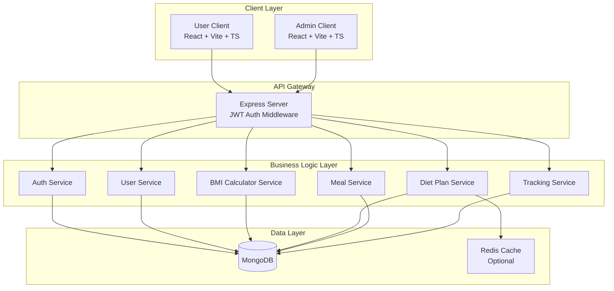
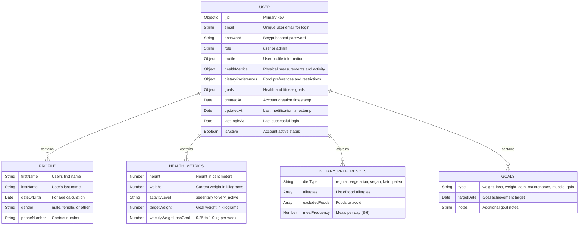
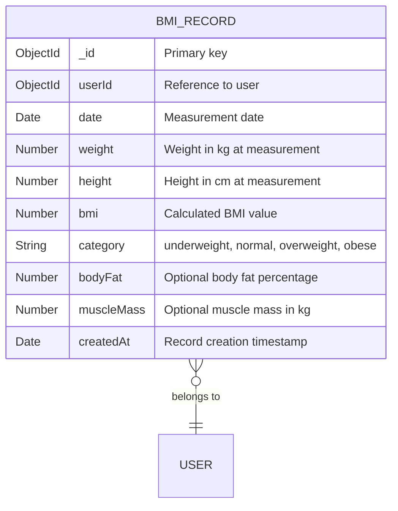
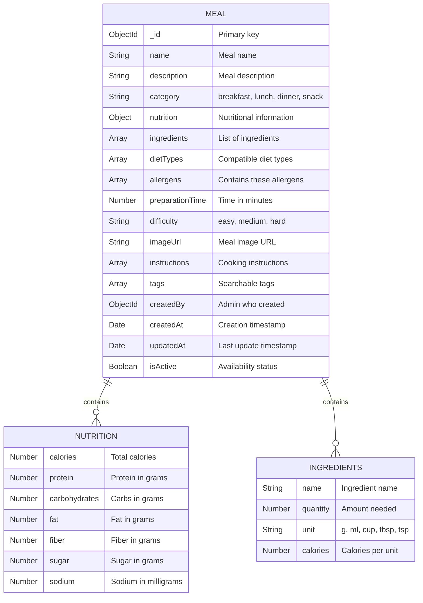
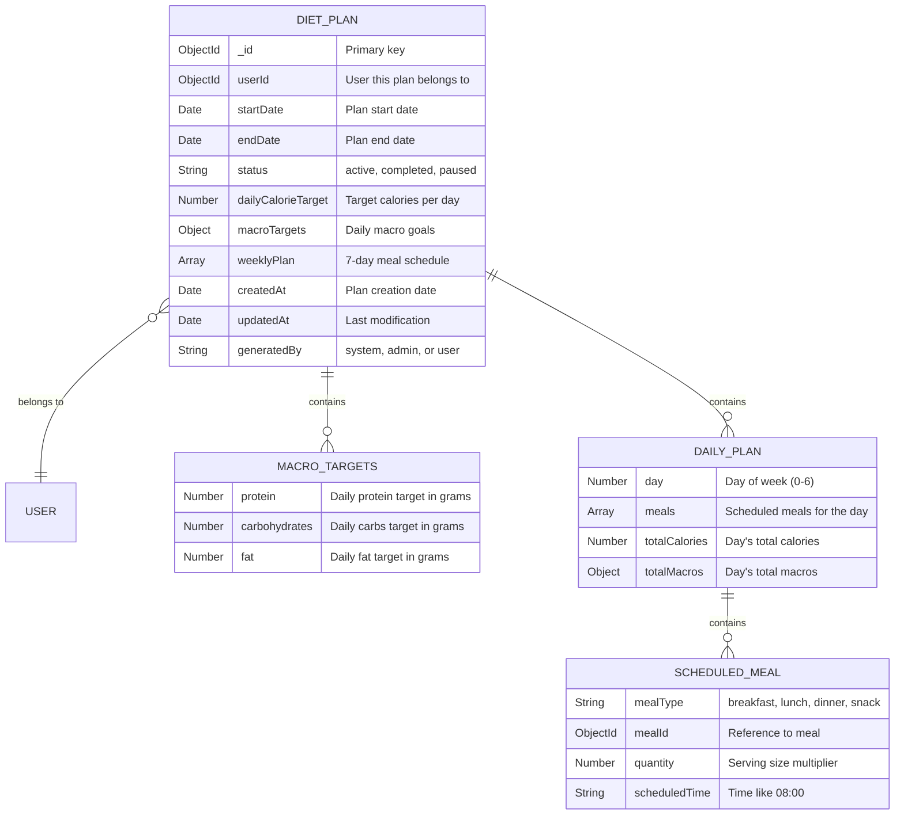
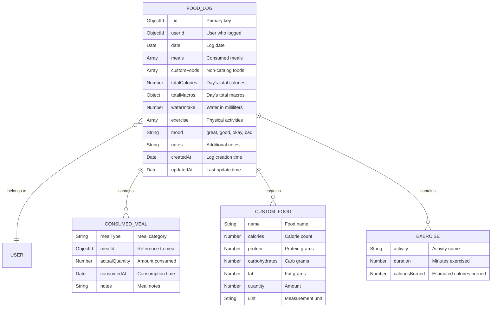
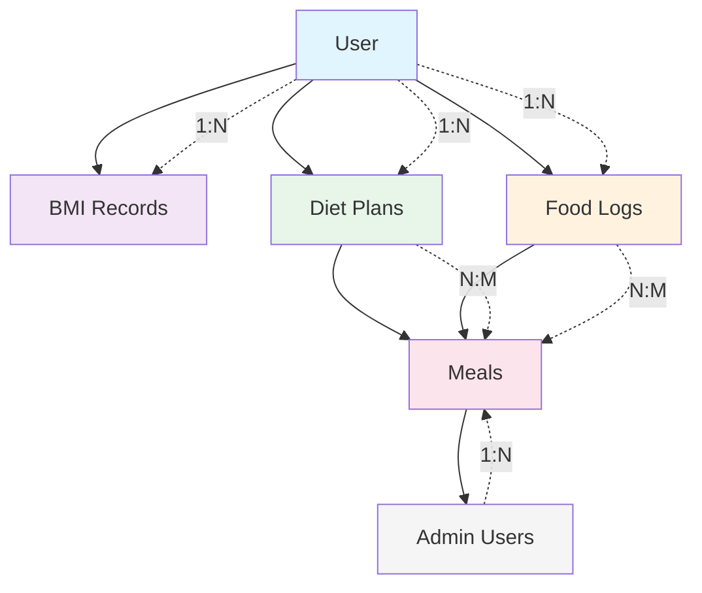
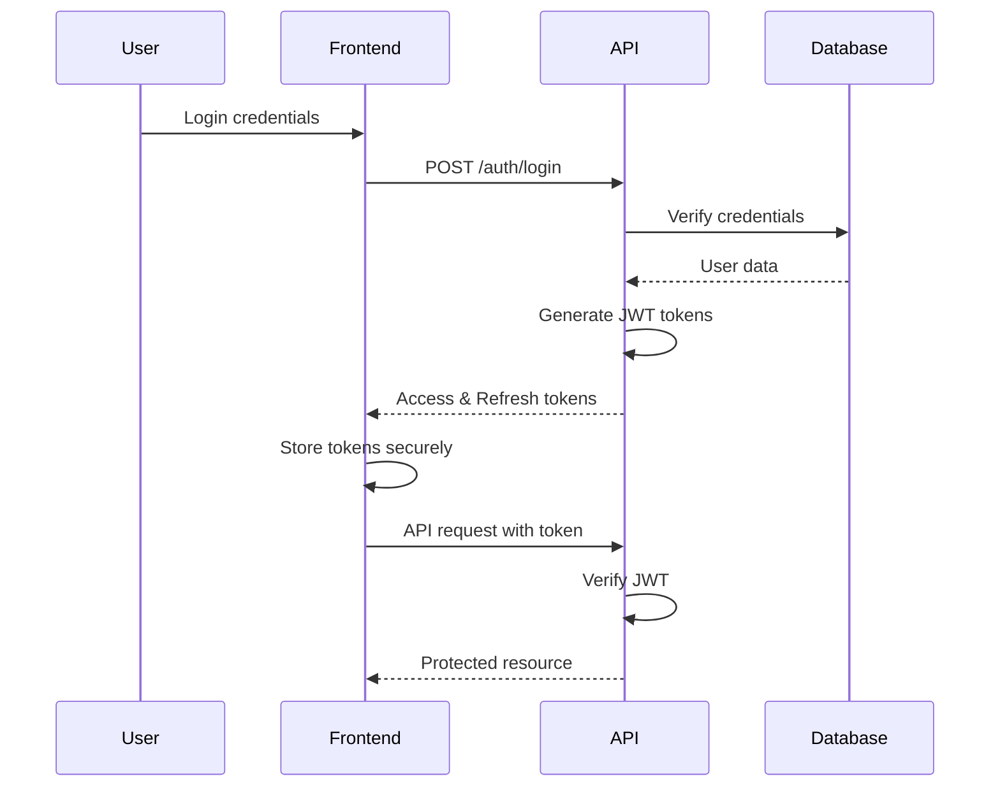
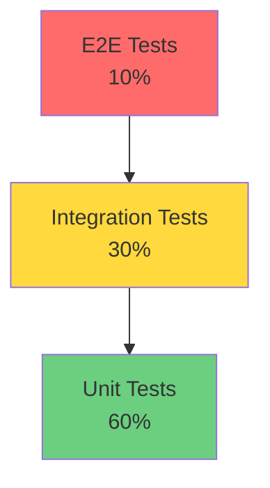

# Personalized Diet Planner MVP Design & Implementation

A comprehensive health and nutrition solution developed for the Bayer Hackathon, providing personalized diet planning and BMI tracking to promote healthier living through data-driven insights and user-centric design.

[](https://nodejs.org/)
[](https://www.typescriptlang.org/)
[](https://reactjs.org/)

## Squad and Team Details

- **Abdul Zelani (<abdul.zelani@hcltech.com>, <azelani31@gmail.com.com>)**
  - Role: Technical Lead
  - Skills:
    - **Backend**: Node.js with Express, Django.
    - **Frontend**: Reactjs, Nextjs, Vuejs, Flutter, Native(Android,Web).
    - **Database**: MongoDB, MySQL, PostgreSQL, MS SQL Server, CockroachDB.
    - **DevOps**: Docker, Kubernetes, GitHub Actions, Azure DevOps.
    - **Cloud**: AWS, Azure, GCP.
    - **Languages**: TypeScript, Python, JavaScript, Dart, Java & Kotlin.
    - **Others**: GraphQL, RESTful APIs, Microservices Architecture and good Embedded Systems knowledge.
  - Company: HCLTech

## Table of Contents

1. [Project Requirements](#project-requirements)
2. [System Architecture](#system-architecture)
3. [Database Schema Design](#database-schema-design)
4. [API Endpoints](#api-endpoints)
5. [Technology Stack & Tools](#technology-stack--tools)
6. [Security Considerations](#security-considerations)
7. [Testing Strategies](#testing-strategies)
8. [Implementation Best Practices](#implementation-best-practices)
9. [User Interface Design](#user-interface-design)
10. [Development Roadmap](#development-roadmap)


## Project Requirements

### Overview

The Personalized Diet Planner is a comprehensive web application designed to help users achieve their health and nutrition goals through data-driven, personalized meal planning. The system calculates users' Body Mass Index (BMI) and creates customized diet plans tailored to their individual health metrics, lifestyle preferences, and objectives.

### Core Requirements

#### 1. User Management & Authentication

- **Secure Registration & Login**: JWT-based authentication system with secure password handling
- **Comprehensive Profile Setup**: Capture essential user data including:
    - Personal information (age, weight, height, gender)
    - Activity level assessment (sedentary to very active)
    - Dietary preferences and restrictions (vegetarian, vegan, allergies, etc.)
    - Health goals (weight loss, maintenance, weight gain, muscle building)
- **Profile Management**: Allow users to update their information and track changes over time

#### 2. BMI Calculation & Health Assessment

- **Real-time BMI Calculator**: Instant BMI calculation based on user inputs
- **Health Category Classification**: Categorize users as underweight, normal weight, overweight, or obese
- **Progress Tracking**: Monitor BMI changes over time with visual representations
- **Health Metrics Dashboard**: Display current health status and progress indicators

#### 3. Personalized Diet Plan Generation

- **Algorithm-Driven Meal Planning**: Generate customized daily and weekly meal plans using:
    - BMI calculations and health goals
    - Caloric needs based on activity level and objectives
    - Dietary preferences and restrictions
    - Macro-nutrient balance (protein, carbohydrates, fats)
- **Flexible Meal Scheduling**: Support for 3-6 meals per day based on user preferences
- **Recipe Database**: Comprehensive meal database with detailed nutritional information
- **Plan Adaptability**: Automatically adjust plans based on updated user metrics

#### 4. Nutritional Tracking & Information

- **Detailed Nutritional Data**: Provide comprehensive nutritional information for each meal including:
    - Calorie content
    - Macro-nutrients (protein, carbs, fats)
    - Micro-nutrients (vitamins, minerals)
    - Fiber, sugar, and sodium content
- **Daily Intake Tracking**: Allow users to log actual food consumption
- **Progress Monitoring**: Track adherence to recommended calorie and nutrient targets
- **Custom Food Entry**: Enable users to add custom foods not in the database

#### 5. Interactive User Dashboard

- **Health Overview**: Display current BMI, weight, and progress towards goals
- **Diet Plan Visualization**: Present meal plans in an intuitive, calendar-like interface
- **Progress Charts**: Visual representation of weight loss/gain progress over time
- **Quick Actions**: Easy access to common tasks like meal logging and plan modifications
- **Goal Tracking**: Monitor progress towards health objectives with milestone indicators

#### 6. Administrative Features

- **Meal Database Management**: Admin interface for adding, editing, and managing meal recipes
- **User Analytics**: System-wide statistics and user engagement metrics
- **Content Moderation**: Tools for managing user-generated content and feedback

## System Architecture



## Database Schema Design

### User Schema



### BMI Record Schema



### Meal Schema



### Diet Plan Schema



### Food Log Schema



### Schema Relationships Overview



### Collection Indexes

```javascript
// User Collection Indexes
db.users.createIndex({ email: 1 }, { unique: true });
db.users.createIndex({ "profile.firstName": 1, "profile.lastName": 1 });
db.users.createIndex({ role: 1, isActive: 1 });
db.users.createIndex({ createdAt: -1 });

// BMI Records Indexes
db.bmiRecords.createIndex({ userId: 1, date: -1 });
db.bmiRecords.createIndex({ userId: 1, createdAt: -1 });

// Meals Collection Indexes
db.meals.createIndex({ name: "text", description: "text" });
db.meals.createIndex({ category: 1, isActive: 1 });
db.meals.createIndex({ dietTypes: 1 });
db.meals.createIndex({ "nutrition.calories": 1 });

// Diet Plans Indexes
db.dietPlans.createIndex({ userId: 1, status: 1 });
db.dietPlans.createIndex({ userId: 1, startDate: -1 });
db.dietPlans.createIndex({ endDate: 1 }, { expireAfterSeconds: 2592000 }); // 30 days

// Food Logs Indexes
db.foodLogs.createIndex({ userId: 1, date: -1 });
db.foodLogs.createIndex({ userId: 1, createdAt: -1 });
db.foodLogs.createIndex({ date: 1 });
```

## API Endpoints

### Authentication Endpoints

```bash
POST   /api/auth/register     - User registration
POST   /api/auth/login        - User login
POST   /api/auth/logout       - User logout
POST   /api/auth/refresh      - Refresh JWT token
POST   /api/auth/forgot-password - Password reset request
POST   /api/auth/reset-password  - Reset password with token
```

### User Management Endpoints

```bash
GET    /api/users/profile     - Get current user profile
PUT    /api/users/profile     - Update user profile
PUT    /api/users/health-metrics - Update health metrics
PUT    /api/users/preferences - Update dietary preferences
PUT    /api/users/goals       - Update health goals
DELETE /api/users/account     - Delete user account

# Admin only
GET    /api/admin/users       - List all users
GET    /api/admin/users/:id   - Get specific user
PUT    /api/admin/users/:id   - Update user (admin)
DELETE /api/admin/users/:id   - Delete user (admin)
```

### BMI Endpoints

```bash
POST   /api/bmi/calculate     - Calculate BMI (no save)
POST   /api/bmi/record        - Save BMI record
GET    /api/bmi/history       - Get user's BMI history
GET    /api/bmi/latest        - Get latest BMI record
DELETE /api/bmi/record/:id    - Delete BMI record
```

### Meal Management Endpoints

```bash
GET    /api/meals             - List meals (with filters)
GET    /api/meals/:id         - Get meal details
GET    /api/meals/search      - Search meals

# Admin only
POST   /api/admin/meals       - Create new meal
PUT    /api/admin/meals/:id   - Update meal
DELETE /api/admin/meals/:id   - Delete meal
POST   /api/admin/meals/bulk  - Bulk import meals
```

### Diet Plan Endpoints

```bash
POST   /api/diet-plans/generate - Generate diet plan
GET    /api/diet-plans/current  - Get current active plan
GET    /api/diet-plans/history  - Get plan history
PUT    /api/diet-plans/:id      - Update diet plan
DELETE /api/diet-plans/:id      - Delete diet plan
POST   /api/diet-plans/:id/activate - Activate a plan
POST   /api/diet-plans/:id/pause    - Pause a plan
```

### Food Tracking Endpoints

```bash
POST   /api/food-logs         - Log food consumption
GET    /api/food-logs/today   - Get today's log
GET    /api/food-logs/date/:date - Get log by date
GET    /api/food-logs/range   - Get logs by date range
PUT    /api/food-logs/:id     - Update food log
DELETE /api/food-logs/:id/meal/:mealId - Remove meal from log
```

### Analytics Endpoints

```bash
GET    /api/analytics/progress - Get weight progress
GET    /api/analytics/adherence - Get diet adherence stats
GET    /api/analytics/nutrition - Get nutrition summary
GET    /api/analytics/trends   - Get health trends

# Admin only
GET    /api/admin/analytics/overview - System overview
GET    /api/admin/analytics/users    - User statistics
```

## Swagger Documentation

The API documentation is available at `/api-docs` and provides detailed information on all endpoints, request/response formats, and examples.

## Technology Stack & Tools

### Backend Technologies

```yaml
Core:
  - Node.js: v22+ LTS
  - Express.js: v4.18+
  - TypeScript: v5.0+
  
Database:
  - MongoDB: v6.0+
  - Mongoose: v7.0+ (ODM)
  - Redis: v7.0+ (Optional caching)
  
Authentication & Security:
  - jsonwebtoken: JWT implementation
  - bcrypt: Password hashing
  - express-rate-limit: Rate limiting
  - helmet: Security headers
  - cors: CORS configuration
  - express-validator: Input validation
  
Utilities:
  - dotenv: Environment variables
  - winston: Logging
  - morgan: HTTP request logging
  - nodemailer: Email notifications
  - multer: File uploads
  - compression: Response compression
  
Development:
  - nodemon: Auto-restart
  - ts-node: TypeScript execution
  - eslint: Code linting
  - prettier: Code formatting
  - jest: Testing framework
  - supertest: API testing
```

### Frontend Technologies

```yaml
Core:
  - React: v18+
  - Vite: v5.0+
  - TypeScript: v5.0+
  
State Management:
  - Redux Toolkit: v2.0+
  - RTK Query: API integration
  
Styling:
  - Tailwind CSS: v3.3+
  - headlessui: Accessible components
  - heroicons: Icon library
  
Routing:
  - React Router: v6.0+
  
Forms & Validation:
  - React Hook Form: v7.0+
  - yup: Schema validation
  
Utilities:
  - axios: HTTP client
  - date-fns: Date manipulation
  - recharts: Charts and graphs
  - react-hot-toast: Notifications
  
Development:
  - ESLint: Code linting
  - Prettier: Code formatting
  - Vitest: Testing
  - React Testing Library: Component testing
```

### DevOps & Deployment

```yaml
Version Control:
  - Git & GitHub
  
CI/CD:
  - GitHub Actions
  
Containerization:
  - Docker
  - Docker Compose
  
Monitoring:
  - PM2: Process management
  - New Relic / DataDog (Optional)
  
Deployment:
  - Backend: AWS EC2 / Heroku / DigitalOcean
  - Frontend: Vercel / Netlify
  - Database: MongoDB Atlas
```

## Security Considerations

### Authentication & Authorization



### Security Best Practices

1. **Authentication**
   - Use bcrypt with salt rounds >= 10
   - Implement JWT with short expiration (15 min access, 7 days refresh)
   - Store refresh tokens in httpOnly cookies
   - Implement token blacklisting for logout

2. **Data Validation**
   - Validate all inputs on both client and server
   - Use parameterized queries (Mongoose handles this)
   - Sanitize user inputs to prevent XSS
   - Implement request size limits

3. **API Security**
   - Use HTTPS in production
   - Implement rate limiting (100 requests/15 min per IP)
   - Add CORS with specific origins
   - Use Helmet.js for security headers

4. **Data Protection**
   - Encrypt sensitive data at rest
   - Use environment variables for secrets
   - Implement field-level encryption for PII
   - Regular security audits

5. **Access Control**
   - Role-based access control (RBAC)
   - Principle of least privilege
   - API key for admin operations
   - Session management

### Security Checklist

```yaml
Authentication:
  ✓ Password complexity requirements
  ✓ Account lockout after failed attempts
  ✓ Two-factor authentication (future)
  ✓ Session timeout
  ✓ Secure password reset flow

API Security:
  ✓ Input validation
  ✓ Output encoding
  ✓ Rate limiting
  ✓ API versioning
  ✓ Request/Response logging

Data Security:
  ✓ Encryption in transit (TLS)
  ✓ Encryption at rest
  ✓ Regular backups
  ✓ Data retention policies
  ✓ GDPR compliance
```

## Testing Strategies

### Testing Pyramid



### Backend Testing

```javascript
// Unit Test Example
describe('BMI Calculator Service', () => {
  test('should calculate BMI correctly', () => {
    const result = calculateBMI(70, 170); // 70kg, 170cm
    expect(result.bmi).toBe(24.22);
    expect(result.category).toBe('normal');
  });
});

// Integration Test Example
describe('Auth API', () => {
  test('POST /api/auth/register', async () => {
    const response = await request(app)
      .post('/api/auth/register')
      .send({
        email: 'test@example.com',
        password: 'Test123!',
        firstName: 'John',
        lastName: 'Doe'
      });
    
    expect(response.status).toBe(201);
    expect(response.body).toHaveProperty('token');
  });
});
```

### Frontend Testing

```javascript
// Component Test Example
describe('BMICalculator Component', () => {
  test('displays BMI result after calculation', async () => {
    render(<BMICalculator />);
    
    fireEvent.change(screen.getByLabelText(/weight/i), {
      target: { value: '70' }
    });
    fireEvent.change(screen.getByLabelText(/height/i), {
      target: { value: '170' }
    });
    fireEvent.click(screen.getByText(/calculate/i));
    
    await waitFor(() => {
      expect(screen.getByText(/24.22/)).toBeInTheDocument();
      expect(screen.getByText(/normal/i)).toBeInTheDocument();
    });
  });
});
```

### Testing Strategy

1. **Unit Tests (60%)**
   - Service functions
   - Utility functions
   - Redux reducers
   - React components

2. **Integration Tests (30%)**
   - API endpoints
   - Database operations
   - Authentication flow
   - Redux actions

3. **E2E Tests (10%)**
   - Critical user journeys
   - Registration/Login flow
   - Diet plan generation
   - Food logging

### Testing Tools

```yaml
Backend:
  - Jest: Test runner
  - Supertest: HTTP assertions
  - MongoDB Memory Server: In-memory DB
  - Sinon: Mocking/Stubbing

Frontend:
  - Vitest: Test runner
  - React Testing Library: Component testing
  - MSW: API mocking
  - Cypress: E2E testing
```

## Implementation Best Practices

### Code Organization

```
diet-planner/
├── backend/
│   ├── src/
│   │   ├── config/         # Configuration files
│   │   ├── controllers/    # Route controllers
│   │   ├── middleware/     # Custom middleware
│   │   ├── models/         # Mongoose models
│   │   ├── routes/         # API routes
│   │   ├── services/       # Business logic
│   │   ├── utils/          # Helper functions
│   │   ├── validators/     # Input validators
│   │   └── app.ts          # Express app setup
│   ├── tests/              # Test files
│   ├── .env.example        # Environment template
│   └── server.ts           # Server entry point
│
├── frontend/
│   ├── admin/              # Admin application
│   │   ├── src/
│   │   │   ├── components/ # Admin-specific components
│   │   │   ├── features/   # Admin feature modules
│   │   │   ├── hooks/      # Admin custom hooks
│   │   │   ├── layouts/    # Admin layout components
│   │   │   ├── pages/      # Admin page components
│   │   │   ├── services/   # Admin API services
│   │   │   ├── store/      # Admin Redux store
│   │   │   ├── types/      # Admin TypeScript types
│   │   │   ├── utils/      # Admin helper functions
│   │   │   └── App.tsx     # Admin main app component
│   │   └── index.html      # Admin entry HTML
│   │
│   └── client/             # User application
│       ├── src/
│       │   ├── components/ # User-specific components
│       │   ├── features/   # User feature modules
│       │   ├── hooks/      # User custom hooks
│       │   ├── layouts/    # User layout components
│       │   ├── pages/      # User page components
│       │   ├── services/   # User API services
│       │   ├── store/      # User Redux store
│       │   ├── types/      # User TypeScript types
│       │   ├── utils/      # User helper functions
│       │   └── App.tsx     # User main app component
│       └── index.html      # User entry HTML
│
└── shared/                 # Shared types/constants
```

### Error Handling

```typescript
// Custom error class
class AppError extends Error {
  constructor(
    public statusCode: number,
    public message: string,
    public isOperational = true
  ) {
    super(message);
    Error.captureStackTrace(this, this.constructor);
  }
}

// Global error handler middleware
const errorHandler = (err: AppError, req: Request, res: Response, next: NextFunction) => {
  const { statusCode = 500, message } = err;
  
  logger.error({
    error: err,
    request: req.url,
    method: req.method,
    ip: req.ip
  });
  
  res.status(statusCode).json({
    status: 'error',
    message: statusCode === 500 ? 'Internal server error' : message
  });
};
```

### API Response Format

```typescript
// Success response
{
  status: 'success',
  data: {
    // Response data
  },
  meta: {
    page: 1,
    limit: 10,
    total: 100
  }
}

// Error response
{
  status: 'error',
  message: 'Error message',
  errors: [
    {
      field: 'email',
      message: 'Invalid email format'
    }
  ]
}
```

### Database Best Practices

1. **Indexing**

   ```javascript
   userSchema.index({ email: 1 }, { unique: true });
   userSchema.index({ 'profile.firstName': 1, 'profile.lastName': 1 });
   mealSchema.index({ name: 'text', description: 'text' });
   ```

2. **Virtuals for Calculated Fields**

   ```javascript
   userSchema.virtual('age').get(function() {
     return Math.floor((Date.now() - this.profile.dateOfBirth) / 31557600000);
   });
   ```

3. **Middleware for Data Consistency**

   ```javascript
   userSchema.pre('save', async function(next) {
     if (this.isModified('password')) {
       this.password = await bcrypt.hash(this.password, 10);
     }
     next();
   });
   ```

## User Interface Design

### User Client Pages

1. **Landing Page**
   - Hero section with CTA
   - Features overview
   - Testimonials

2. **Authentication**
   - Login form
   - Registration wizard
   - Password reset

3. **Dashboard**
   - BMI display widget
   - Current diet plan overview
   - Today's meals
   - Progress chart
   - Quick actions

4. **Profile Management**
   - Personal information
   - Health metrics
   - Dietary preferences
   - Goal settings

5. **Diet Plan**
   - Weekly meal calendar
   - Daily meal details
   - Shopping list generator
   - Meal swap options

6. **Food Tracking**
   - Food search
   - Meal logging
   - Water intake
   - Exercise logging

7. **Analytics**
   - Weight progress chart
   - Calorie trends
   - Macro distribution
   - Goal progress

### Admin Client Pages

1. **Admin Dashboard**
   - User statistics
   - System health
   - Recent activities

2. **User Management**
   - User list with filters
   - User details view
   - Edit user capabilities

3. **Meal Management**
   - Meal list/grid
   - Add/Edit meal form
   - Bulk import
   - Nutrition calculator

4. **Analytics**
   - User engagement
   - Popular meals
   - System usage

### UI Component Examples

```typescript
// Reusable BMI Display Component
interface BMIDisplayProps {
  value: number;
  category: string;
  date: Date;
}

export const BMIDisplay: React.FC<BMIDisplayProps> = ({ value, category, date }) => {
  const getCategoryColor = (category: string) => {
    const colors = {
      underweight: 'text-blue-600',
      normal: 'text-green-600',
      overweight: 'text-yellow-600',
      obese: 'text-red-600'
    };
    return colors[category] || 'text-gray-600';
  };

  return (
    <div className="bg-white rounded-lg shadow p-6">
      <h3 className="text-lg font-semibold mb-2">Your BMI</h3>
      <div className="text-3xl font-bold mb-1">{value.toFixed(1)}</div>
      <div className={`text-sm font-medium ${getCategoryColor(category)}`}>
        {category.charAt(0).toUpperCase() + category.slice(1)}
      </div>
      <div className="text-xs text-gray-500 mt-2">
        Last updated: {format(date, 'MMM d, yyyy')}
      </div>
    </div>
  );
};
```

## Development Roadmap

### Phase 1: Foundation

- [ ] Project setup and configuration
- [ ] Database schema implementation
- [ ] Authentication system
- [ ] Basic user CRUD operations
- [ ] BMI calculation service

### Phase 2: Core Features

- [ ] Meal management system
- [ ] Diet plan generation algorithm
- [ ] Food tracking functionality
- [ ] Basic UI components
- [ ] User dashboard

### Phase 3: Enhancement

- [ ] Analytics and reporting
- [ ] Admin panel
- [ ] Advanced meal search
- [ ] Notification system
- [ ] Performance optimization

### Phase 4: Polish & Deploy

- [ ] Comprehensive testing
- [ ] Security audit
- [ ] Documentation
- [ ] Deployment setup
- [ ] Production monitoring

## Conclusion

This MVP design provides a solid foundation for building a personalized diet planner application. The architecture is scalable, secure, and follows industry best practices. The modular design allows for easy maintenance and future enhancements. I have used Service-Oriented Architecture (SOA) principles to ensure that each component can evolve independently while maintaining a cohesive user experience.

---

BY Abdul Zelani
HCLTech
abdul.zelani@hcltech.com
