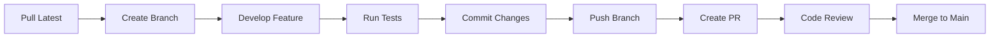

# 🎯 Fullstack Template - Development Workflow

A comprehensive guide for development workflow, best practices, and team collaboration.

## 📋 Table of Contents
- [Getting Started](#getting-started)
- [Development Workflow](#development-workflow)
- [Git Workflow](#git-workflow)
- [Code Standards](#code-standards)
- [Testing Strategy](#testing-strategy)
- [Documentation](#documentation)
- [Team Collaboration](#team-collaboration)

## 🚀 Getting Started

### Prerequisites
- **Node.js**: 18.x or higher
- **npm**: 9.x or higher
- **MongoDB**: 6.x or higher (local or Atlas)
- **Git**: Latest version

### Initial Setup
```bash
# Clone the repository
git clone <repository-url>
cd fullstack-template

# Install dependencies
npm run install:all

# Set up environment variables
cp backend/.env.example backend/.env
cp frontend/client/.env.example frontend/client/.env
cp frontend/admin/.env.example frontend/admin/.env

# Configure your environment variables
# Edit the .env files with your settings

# Start development servers
npm run dev
```

### Verification
```bash
# Check backend health
curl http://localhost:5000/health

# Check frontend applications
# Client: http://localhost:3000
# Admin: http://localhost:3001
```

## 🔄 Development Workflow

### 1. Daily Development Cycle



### 2. Workspace Structure
```
fullstack-template/
├── backend/                 # Backend API
│   ├── src/                # Source code
│   ├── tests/              # Test files
│   └── dist/               # Built files
├── frontend/               # Frontend applications
│   ├── client/             # Client application
│   ├── admin/              # Admin dashboard
│   └── shared/             # Shared components/types
├── shared/                 # Shared types/utilities
├── docs/                   # Documentation
└── scripts/                # Build/deployment scripts
```

### 3. Development Commands

**Root Level Commands:**
```bash
# Install all dependencies
npm run install:all

# Start all development servers
npm run dev

# Build all applications
npm run build:all

# Run all tests
npm run test:all

# Lint all code
npm run lint:all

# Format all code
npm run format:all

# Clean all builds
npm run clean:all
```

**Backend Commands:**
```bash
cd backend

# Development with hot reload
npm run dev

# Build TypeScript
npm run build

# Start production server
npm start

# Run tests
npm test
npm run test:watch
npm run test:coverage

# Database operations
npm run db:seed        # Seed with sample data
npm run db:migrate     # Run migrations
npm run db:reset       # Reset database
```

**Frontend Commands:**
```bash
cd frontend/client  # or frontend/admin

# Development server
npm run dev

# Build for production
npm run build

# Preview production build
npm run preview

# Run tests
npm test
npm run test:ui
npm run test:coverage

# Type checking
npm run type-check
```

## 🌿 Git Workflow

### Branch Strategy
We use **GitFlow** with the following branches:

- **main**: Production-ready code
- **develop**: Integration branch for features
- **feature/**: Individual feature development
- **hotfix/**: Critical bug fixes
- **release/**: Preparation for releases

### Branch Naming Convention
```bash
feature/auth-system
feature/user-dashboard
bugfix/login-validation
hotfix/security-patch
release/v1.2.0
```

### Commit Message Format
```
type(scope): subject

body (optional)

footer (optional)
```

**Types:**
- `feat`: New feature
- `fix`: Bug fix
- `docs`: Documentation changes
- `style`: Code style changes
- `refactor`: Code refactoring
- `test`: Adding tests
- `chore`: Build process or auxiliary tool changes

**Examples:**
```bash
feat(auth): add JWT refresh token functionality

- Implement refresh token rotation
- Add refresh token blacklisting
- Update authentication middleware

Closes #123
```

### Pull Request Process

1. **Create Feature Branch:**
   ```bash
   git checkout develop
   git pull origin develop
   git checkout -b feature/your-feature-name
   ```

2. **Develop and Commit:**
   ```bash
   # Make your changes
   git add .
   git commit -m "feat(component): add new feature"
   ```

3. **Push and Create PR:**
   ```bash
   git push origin feature/your-feature-name
   # Create PR through GitHub/GitLab interface
   ```

4. **PR Requirements:**
   - [ ] All tests pass
   - [ ] Code coverage maintained
   - [ ] Documentation updated
   - [ ] No linting errors
   - [ ] Code reviewed by team member

## 📏 Code Standards

### TypeScript Guidelines

**Naming Conventions:**
```typescript
// PascalCase for types, interfaces, classes
interface UserProfile { }
class AuthService { }
type ApiResponse<T> = { }

// camelCase for variables, functions
const userProfile = {};
function getUserData() { }

// UPPER_SNAKE_CASE for constants
const API_BASE_URL = 'https://api.example.com';

// kebab-case for files/folders
user-profile.component.tsx
auth-service.ts
```

**Interface vs Type:**
```typescript
// Use interface for object shapes that might be extended
interface User {
  id: string;
  name: string;
}

interface AdminUser extends User {
  permissions: string[];
}

// Use type for unions, primitives, computed types
type Status = 'pending' | 'approved' | 'rejected';
type UserWithRole = User & { role: Role };
```

**Function Declarations:**
```typescript
// Prefer function declarations for top-level functions
function processUserData(user: User): ProcessedUser {
  // implementation
}

// Use arrow functions for callbacks and short functions
const users = data.map(item => transformUser(item));

// Use async/await over Promises
async function fetchUserData(id: string): Promise<User> {
  try {
    const response = await api.get(`/users/${id}`);
    return response.data;
  } catch (error) {
    throw new ApiError('Failed to fetch user', error);
  }
}
```

### React Guidelines

**Component Structure:**
```tsx
// 1. Imports
import React, { useState, useEffect } from 'react';
import { useNavigate } from 'react-router-dom';

// 2. Types
interface UserProfileProps {
  userId: string;
  onUpdate?: (user: User) => void;
}

// 3. Component
export const UserProfile: React.FC<UserProfileProps> = ({
  userId,
  onUpdate,
}) => {
  // 4. Hooks
  const navigate = useNavigate();
  const [user, setUser] = useState<User | null>(null);
  const [loading, setLoading] = useState(true);

  // 5. Effects
  useEffect(() => {
    // effect logic
  }, [userId]);

  // 6. Handlers
  const handleUpdate = useCallback((updatedUser: User) => {
    setUser(updatedUser);
    onUpdate?.(updatedUser);
  }, [onUpdate]);

  // 7. Render
  if (loading) return <LoadingSpinner />;
  if (!user) return <ErrorMessage />;

  return (
    <div className="user-profile">
      {/* component JSX */}
    </div>
  );
};
```

**Custom Hooks:**
```tsx
// hooks/useAuth.ts
export const useAuth = () => {
  const dispatch = useAppDispatch();
  const { user, isAuthenticated, loading } = useAppSelector(state => state.auth);

  const login = useCallback(async (credentials: LoginCredentials) => {
    try {
      await dispatch(loginThunk(credentials)).unwrap();
    } catch (error) {
      throw new AuthError('Login failed', error);
    }
  }, [dispatch]);

  return {
    user,
    isAuthenticated,
    loading,
    login,
    logout: () => dispatch(logout()),
  };
};
```

### CSS/Tailwind Guidelines

**Utility-First Approach:**
```tsx
// Prefer Tailwind utilities
<div className="flex items-center justify-between p-4 bg-white shadow-md rounded-lg">
  <h2 className="text-xl font-semibold text-gray-900">Title</h2>
  <button className="px-4 py-2 bg-blue-600 text-white rounded hover:bg-blue-700 transition-colors">
    Action
  </button>
</div>

// Use component classes for repeated patterns
<div className="card">
  <div className="card-header">
    <h2 className="card-title">Title</h2>
  </div>
</div>
```

**Custom Component Styles:**
```css
/* components/Card.css */
@layer components {
  .card {
    @apply bg-white shadow-md rounded-lg overflow-hidden;
  }
  
  .card-header {
    @apply px-6 py-4 border-b border-gray-200;
  }
  
  .card-title {
    @apply text-xl font-semibold text-gray-900;
  }
}
```

## 🧪 Testing Strategy

### Testing Pyramid
```
    🔺 E2E Tests (Few)
   🔺🔺 Integration Tests (Some)
  🔺🔺🔺 Unit Tests (Many)
```

### Backend Testing

**Unit Tests:**
```typescript
// tests/services/userService.test.ts
describe('UserService', () => {
  beforeEach(async () => {
    await setupTestDb();
  });

  afterEach(async () => {
    await cleanupTestDb();
  });

  describe('createUser', () => {
    it('should create a new user with valid data', async () => {
      const userData = {
        email: 'test@example.com',
        password: 'password123',
        name: 'Test User',
      };

      const user = await userService.createUser(userData);

      expect(user).toMatchObject({
        email: userData.email,
        name: userData.name,
      });
      expect(user.password).not.toBe(userData.password); // Should be hashed
    });

    it('should throw error for duplicate email', async () => {
      const userData = {
        email: 'duplicate@example.com',
        password: 'password123',
        name: 'Test User',
      };

      await userService.createUser(userData);

      await expect(userService.createUser(userData))
        .rejects.toThrow('Email already exists');
    });
  });
});
```

**Integration Tests:**
```typescript
// tests/integration/auth.test.ts
describe('Authentication API', () => {
  it('should handle complete auth flow', async () => {
    // Register
    const registerResponse = await request(app)
      .post('/api/auth/register')
      .send({
        email: 'test@example.com',
        password: 'password123',
        name: 'Test User',
      })
      .expect(201);

    const { user, token } = registerResponse.body;

    // Login
    const loginResponse = await request(app)
      .post('/api/auth/login')
      .send({
        email: 'test@example.com',
        password: 'password123',
      })
      .expect(200);

    // Protected route
    await request(app)
      .get('/api/auth/profile')
      .set('Authorization', `Bearer ${loginResponse.body.token}`)
      .expect(200);
  });
});
```

### Frontend Testing

**Component Tests:**
```tsx
// components/__tests__/UserProfile.test.tsx
import { render, screen, waitFor } from '@testing-library/react';
import userEvent from '@testing-library/user-event';
import { UserProfile } from '../UserProfile';

const mockUser = {
  id: '1',
  name: 'John Doe',
  email: 'john@example.com',
};

describe('UserProfile', () => {
  it('renders user information', async () => {
    render(<UserProfile userId="1" />);

    await waitFor(() => {
      expect(screen.getByText('John Doe')).toBeInTheDocument();
      expect(screen.getByText('john@example.com')).toBeInTheDocument();
    });
  });

  it('handles edit functionality', async () => {
    const user = userEvent.setup();
    const onUpdate = jest.fn();

    render(<UserProfile userId="1" onUpdate={onUpdate} />);

    const editButton = await screen.findByRole('button', { name: /edit/i });
    await user.click(editButton);

    const nameInput = screen.getByLabelText(/name/i);
    await user.clear(nameInput);
    await user.type(nameInput, 'Jane Doe');

    const saveButton = screen.getByRole('button', { name: /save/i });
    await user.click(saveButton);

    await waitFor(() => {
      expect(onUpdate).toHaveBeenCalledWith(
        expect.objectContaining({ name: 'Jane Doe' })
      );
    });
  });
});
```

**Hook Tests:**
```tsx
// hooks/__tests__/useAuth.test.tsx
import { renderHook, act } from '@testing-library/react';
import { useAuth } from '../useAuth';

describe('useAuth', () => {
  it('should handle login flow', async () => {
    const { result } = renderHook(() => useAuth());

    expect(result.current.isAuthenticated).toBe(false);

    await act(async () => {
      await result.current.login({
        email: 'test@example.com',
        password: 'password123',
      });
    });

    expect(result.current.isAuthenticated).toBe(true);
    expect(result.current.user).toBeDefined();
  });
});
```

### E2E Testing (Playwright)

```typescript
// e2e/auth.spec.ts
import { test, expect } from '@playwright/test';

test.describe('Authentication Flow', () => {
  test('user can register, login, and access protected pages', async ({ page }) => {
    // Registration
    await page.goto('/register');
    await page.fill('[data-testid=name-input]', 'Test User');
    await page.fill('[data-testid=email-input]', 'test@example.com');
    await page.fill('[data-testid=password-input]', 'password123');
    await page.click('[data-testid=register-button]');

    // Should redirect to dashboard
    await expect(page).toHaveURL('/dashboard');
    await expect(page.locator('[data-testid=welcome-message]')).toContainText('Welcome, Test User');

    // Logout
    await page.click('[data-testid=logout-button]');
    await expect(page).toHaveURL('/login');

    // Login
    await page.fill('[data-testid=email-input]', 'test@example.com');
    await page.fill('[data-testid=password-input]', 'password123');
    await page.click('[data-testid=login-button]');

    // Should be back in dashboard
    await expect(page).toHaveURL('/dashboard');
  });
});
```

## 📚 Documentation

### Code Documentation

**JSDoc for Functions:**
```typescript
/**
 * Creates a new user with the provided data
 * @param userData - The user data to create
 * @param options - Additional options for user creation
 * @returns Promise resolving to the created user
 * @throws {ValidationError} When user data is invalid
 * @throws {ConflictError} When email already exists
 * @example
 * ```typescript
 * const user = await createUser({
 *   email: 'user@example.com',
 *   password: 'securepassword',
 *   name: 'John Doe'
 * });
 * ```
 */
async function createUser(
  userData: CreateUserData,
  options: CreateUserOptions = {}
): Promise<User> {
  // implementation
}
```

**Component Documentation:**
```tsx
/**
 * UserProfile component displays and allows editing of user information
 * 
 * @component
 * @example
 * ```tsx
 * <UserProfile 
 *   userId="123" 
 *   onUpdate={(user) => console.log('User updated:', user)}
 * />
 * ```
 */
interface UserProfileProps {
  /** The ID of the user to display */
  userId: string;
  /** Callback fired when user data is updated */
  onUpdate?: (user: User) => void;
  /** Whether the profile is in read-only mode */
  readonly?: boolean;
}
```

### API Documentation

We use Swagger/OpenAPI for API documentation:

```typescript
/**
 * @swagger
 * /api/users:
 *   get:
 *     summary: Get all users
 *     tags: [Users]
 *     security:
 *       - bearerAuth: []
 *     parameters:
 *       - in: query
 *         name: page
 *         schema:
 *           type: integer
 *           minimum: 1
 *         description: Page number
 *     responses:
 *       200:
 *         description: List of users
 *         content:
 *           application/json:
 *             schema:
 *               type: object
 *               properties:
 *                 users:
 *                   type: array
 *                   items:
 *                     $ref: '#/components/schemas/User'
 */
```

## 👥 Team Collaboration

### Code Review Guidelines

**Before Submitting PR:**
- [ ] Self-review your code
- [ ] Run all tests locally
- [ ] Update documentation
- [ ] Add/update tests for new features
- [ ] Follow commit message conventions

**Review Checklist:**
- [ ] Code follows style guidelines
- [ ] Logic is clear and well-commented
- [ ] Tests are comprehensive
- [ ] No security vulnerabilities
- [ ] Performance considerations
- [ ] Error handling is robust

**Review Process:**
1. **Author**: Create PR with clear description
2. **Reviewer**: Review within 24 hours
3. **Author**: Address feedback promptly
4. **Reviewer**: Approve or request changes
5. **Author**: Merge after approval

### Communication

**Daily Standups:**
- What did you work on yesterday?
- What will you work on today?
- Any blockers or dependencies?

**Sprint Planning:**
- Review backlog items
- Estimate effort required
- Assign tasks to team members
- Define sprint goals

### Project Management

**Issue Templates:**
```markdown
## Bug Report
**Describe the bug**
A clear description of what the bug is.

**Steps to Reproduce**
1. Go to '...'
2. Click on '...'
3. Scroll down to '...'
4. See error

**Expected Behavior**
What you expected to happen.

**Screenshots**
Add screenshots if applicable.

**Environment**
- OS: [e.g. iOS]
- Browser: [e.g. chrome, safari]
- Version: [e.g. 22]
```

**Feature Request:**
```markdown
## Feature Request
**Is your feature request related to a problem?**
A clear description of what the problem is.

**Describe the solution you'd like**
A clear description of what you want to happen.

**Additional context**
Add any other context about the feature request.
```

### Development Environment

**IDE Setup:**
- **VS Code Extensions:**
  - TypeScript Importer
  - ESLint
  - Prettier
  - Auto Rename Tag
  - Bracket Pair Colorizer
  - GitLens

**Shared Configuration:**
```json
// .vscode/settings.json
{
  "editor.defaultFormatter": "esbenp.prettier-vscode",
  "editor.formatOnSave": true,
  "editor.codeActionsOnSave": {
    "source.fixAll.eslint": true
  },
  "typescript.preferences.importModuleSpecifier": "relative"
}
```

### Knowledge Sharing

**Tech Talks:** Monthly presentations on new technologies or techniques
**Code Reviews:** Learning opportunities for team members
**Documentation:** Keep README and docs up to date
**Pair Programming:** Collaborate on complex features

This workflow guide should be customized based on your team's specific needs and preferences.
